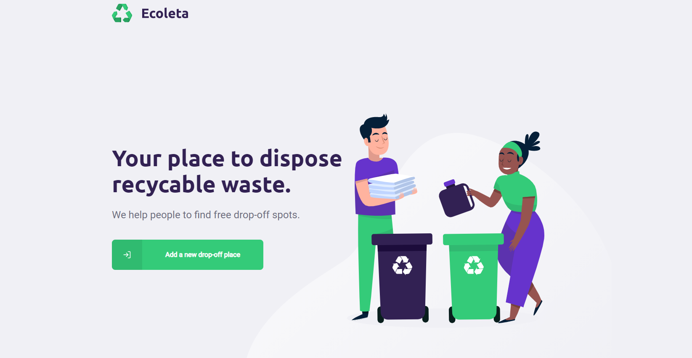
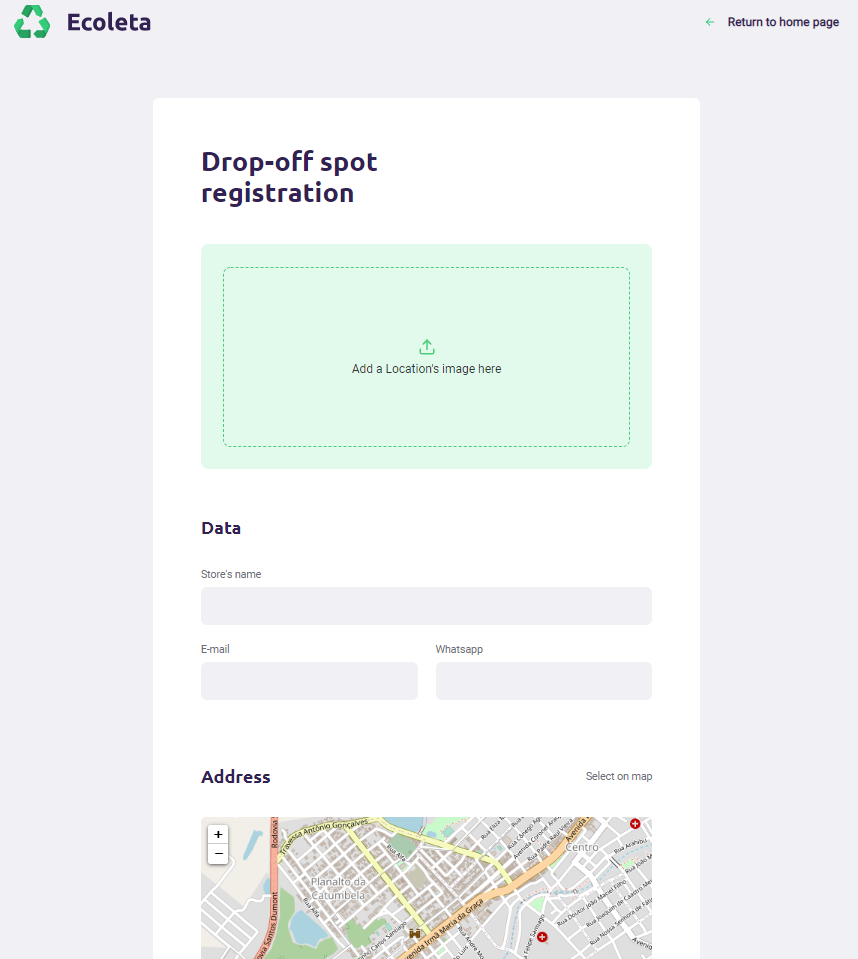

I was able to build this project during the Next Level Week 01 (Rocketseat)

NLW - Ecoleta
Project made at the workshop: Next Level Week #1 (Jun/2020)

Tools and Libs used:

NodeJS on server side (backend):
  - Express
  - Controllers classes
  - Routes
  - Knex (for migrations and seeds);
  - Sqlite (db)
  - Multer (to upload image)
  - Celebrate (form validation)
  
ReactJS on web (front end):
  - Pages and Components (useState, useEffect)
  - Routes (navigation)
  - Link (spa)
  - Form
  - Props (interfaces)
  - Css
  - Icons
  - Dropzone (to submit image)
  - Leaflet (map)
  - axios (for api)

React Native App (mobile);
  - Expo
  - Pages (Texts, Views, Images, Fragments)
  - Props (interfaces)
  - api
  - Css (Stylesheet)
  

Thanks Rocketseat for this opportunity to learn new skills <3
